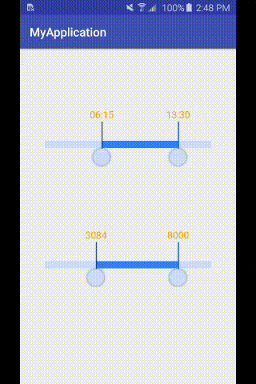

# CustomRangeSeekBar

(https://jitpack.io/#User/Repo)




## Attributes

|         attr         |  format   |               description                |
| :------------------: | :-------: | :--------------------------------------: |
|     absoluteMin      |   float   | min value, absoluteMin<=absolutemMax, default:0 |
|     absolutemMax     |   float   | Max value, absoluteMax>=absolutemMax, default:100 |
|   startMinPercent    |   float   | Min seekbar init value, startMinPercent<=startMaxPercent, scope:[0-1], default:0 |
|   startMaxPercent    |   float   | Max seekbar init value, startMinPercent<=startMaxPercent, scope:[0-1], default:1 |
| betweenAbsoluteValue |   float   | The minimum distance between two thumb, default:0 |
|  progressTextFormat  |   enum    | The progress text format, **numberFormat**:progress show number format; **timeFormat**: progress show time format, default:numberFormat |
|      thumbImage      | reference | seekbar thumb resource, default the top screenshot image |
|    progressBarBg     | reference | The progressbar background resource, default the top screenshot image |
|   progressBarSelBg   | reference | The selected progressbar background resource, default the top screenshot image |
|   progressTextSize   | dimension | The selected progressbar progress text size, default 16dp |


## Usage

### Step1:
build.gradle in root project
```
allprojects {
    repositories {
        jcenter()
        maven { url 'https://jitpack.io' }
    }
}
```
build.gradle in app module

```
dependencies {
    compile 'com.github.zyl409214686:CustomRangeSeekBar:v1.0.1'
}
```

### Step2:
```
<com.zyl.customrangeseekbar.CustomRangeSeekBar
        android:layout_width="match_parent"
        android:layout_height="wrap_content"
        android:layout_below="@id/seekbar_time"
        android:layout_marginTop="100dp"
        rangeseekbar:progressBarBg="@mipmap/seekbar_bg"
        rangeseekbar:progressBarSelBg="@mipmap/seekbar_sel_bg"
        rangeseekbar:thumbImage="@mipmap/btn_seekbar_normal"
        rangeseekbar:startMinPercent="0.2"
        rangeseekbar:startMaxPercent="0.8"
        rangeseekbar:absolutemMax="10000"
        rangeseekbar:absoluteMin="0"
        rangeseekbar:progressTextSize="16dp"
        rangeseekbar:progressTextFormat="numberFormat"
        rangeseekbar:betweenAbsoluteValue="2000"
        />
```


##Update

| version | message                                  |
| :-----: | :--------------------------------------- |
| v1.0.1  | add startMinPercent、startMaxPercent Attributes |
| v1.0.2  | add demo module and refactor code |


##  [Blog](http://zouyulong.com/2017/12/11/android-自定义范围选取控件CustomRangeSeekBar/)


I hope you like this CustomRangeSeekBar. `Star` is the greatest support for me！ Thank U

